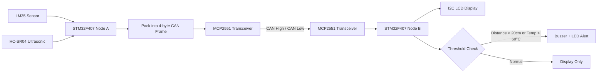

# Driver Alert System using CAN Protocol

<div align="center">
  
  
  
  
</div>

<div align="center">
  <p>
    A real-time automotive driver alert system using CAN protocol for inter-node communication between sensing and actuation nodes built on STM32F407 microcontrollers.
  </p>

  
</div>

<br />

## 📋 Table of Contents

- [About the Project](#about-the-project)
  - [Tech Stack](#tech-stack)
  - [Features](#features)
  - [Architecture](#architecture)
- [Getting Started](#getting-started)
  - [Prerequisites](#prerequisites)
  - [Hardware Requirements](#hardware-requirements)
  - [Circuit Setup](#circuit-setup)
- [System Design](#system-design)
  - [Block Diagram](#block-diagram)
  - [Data Flow](#data-flow)
  - [State Machine](#state-machine)
- [Source Code Overview](#source-code-overview)
- [Testing & Results](#testing--results)
- [Performance Metrics](#performance-metrics)
- [Future Scope](#future-scope)
- [References](#references)
- [Acknowledgements](#acknowledgements)

---

## 🚗 About the Project

The **Driver Alert System using CAN Protocol** is an embedded automotive safety solution designed to monitor critical vehicle parameters in real time and alert the driver when thresholds are breached. It implements a two-node CAN bus architecture using the STM32F407 Discovery Board, where one node continuously senses temperature and proximity data and transmits it over CAN bus to a second node that drives a display and buzzer alert.

### Key Highlights

- **CAN Bus Communication**: Uses STM32F407's built-in CAN peripheral with MCP2551 transceivers for reliable differential-voltage communication
- **Dual-Parameter Monitoring**: Simultaneously tracks engine temperature (LM35) and obstacle proximity (HC-SR04 Ultrasonic)
- **Real-Time Alerting**: Triggers buzzer and LCD alert when distance < 20 cm or temperature exceeds 60°C
- **Interrupt-Driven Design**: Timer input-capture interrupts for precise ultrasonic echo measurement; CAN RX FIFO interrupt for non-blocking reception
- **Standard CAN Frame**: Uses 11-bit standard identifier (0x0A9), 4-byte data payload, and FIFO-based message filtering

---

### 🛠️ Tech Stack

<details>
  <summary>Embedded Systems</summary>
  <ul>
    <li><a href="https://www.st.com/en/microcontrollers-microprocessors/stm32f407vg.html">STM32F407 Discovery Board</a> — ARM Cortex-M4 @ 168 MHz, used for both Sensing Node and Actuation Node</li>
    <li><a href="https://www.microchip.com/en-us/product/MCP2551">MCP2551 CAN Transceiver</a> — ISO-11898 compliant, supports up to 1 Mb/s</li>
    <li><a href="https://www.st.com/en/development-tools/stm32cubeide.html">STM32CubeIDE</a> — Eclipse/CDT-based development environment with HAL code generation</li>
  </ul>
</details>

<details>
  <summary>Sensors & Peripherals</summary>
  <ul>
    <li><a href="https://www.ti.com/product/LM35">LM35 Temperature Sensor</a> — Analog, 10 mV/°C, connected to ADC on Sensing Node</li>
    <li><a href="https://www.sparkfun.com/products/15569">HC-SR04 Ultrasonic Sensor</a> — 2 cm–400 cm range, Timer Input Capture on TIM4</li>
    <li>I2C 20×4 LCD Module — I2C address 0x3F, driven via PB6 (SCL) and PB7 (SDA)</li>
    <li>Piezoelectric Buzzer — GPIO output PB14, 3–24V operating range</li>
  </ul>
</details>

<details>
  <summary>Communication Protocols</summary>
  <ul>
    <li>CAN Bus (ISO 11898-2) — Primary inter-node communication at up to 1 Mb/s</li>
    <li>I²C — LCD display interface on Actuation Node</li>
    <li>UART — Debug output via USART2 on both nodes</li>
    <li>Timer Input Capture (TIM4) — Echo pulse measurement for HC-SR04</li>
  </ul>
</details>

---

### 🎯 Features

- **Engine Temperature Monitoring**: LM35 reads analog temperature; triggers alert above 60°C
- **Obstacle Distance Detection**: HC-SR04 ultrasonic sensor measures distance; triggers alert below 20 cm
- **CAN Bus Transmission**: Sensor data packed into 4-byte CAN frame and sent every 1 second
- **Real-Time LCD Display**: Distance and temperature continuously displayed on 20×4 I2C LCD
- **Buzzer/LED Alert**: GPIO-driven alert on Actuation Node when thresholds are crossed
- **UART Debug Output**: Sensor values streamed to serial terminal for debugging
- **Interrupt-Driven Reception**: CAN RX FIFO0 interrupt callback for zero-polling data reception
- **Standard CAN Filtering**: Hardware-level message filtering (ID mask: 0xFF00) for clean FIFO handling

---

### 🏗️ Architecture

The system uses a **two-node CAN bus architecture**:

**Sensing Node (STM32F407 — Node A / Transmitter)**
- LM35 temperature sensor on ADC input
- HC-SR04 ultrasonic sensor via TIM4 Input Capture (echo pin)
- MCP2551 CAN transceiver on PB9 (CAN TX) and PB8 (CAN RX)
- Packs distance + temperature into 4-byte CAN data frame and transmits every 1 second

**Actuation/Display Node (STM32F407 — Node B / Receiver)**
- MCP2551 CAN transceiver for reception
- I2C LCD (PB6 = SCL, PB7 = SDA) for live data display
- Buzzer/LED on PB14 for threshold alerts
- UART2 for serial debug output

Both nodes share a common CAN bus via **CAN High** and **CAN Low** differential lines.

---

## 🚀 Getting Started

### ⚡ Prerequisites

- STM32CubeIDE (v1.9 or later)
- STM32CubeMX (integrated with CubeIDE)
- ST-LINK/V2 USB debugger (onboard on Discovery board)
- USB-UART adapter (for serial debug monitoring)

### 🔧 Hardware Requirements

| Component | Qty | Purpose |
|-----------|-----|---------|
| STM32F407G-DISC1 Discovery Board | 2 | Sensing Node + Actuation Node |
| MCP2551 CAN Transceiver Module | 2 | CAN bus physical layer |
| LM35 Temperature Sensor | 1 | Engine temperature measurement |
| HC-SR04 Ultrasonic Sensor | 1 | Obstacle distance measurement |
| I2C 20×4 LCD Module | 1 | Real-time data display |
| Piezoelectric Buzzer | 1 | Audio alert on threshold breach |
| 120Ω Termination Resistors | 2 | CAN bus line termination |
| Breadboard + Jumper Wires | — | Circuit assembly |
| 5V / 3.3V Power Supply | 2 | Board and peripheral power |

---

### 🔌 Circuit Setup

**Sensing Node — STM32F407 (Transmitter):**
```
LM35 Temperature Sensor:   OUT → PA0 (ADC1_IN0), VCC → 3.3V, GND → GND
HC-SR04 Ultrasonic:        Trig → PD11 (GPIO Output), Echo → PA0/TIM4_CH (Input Capture)
MCP2551 CAN Transceiver:   TXD ← PB9 (CAN1_TX), RXD → PB8 (CAN1_RX)
CAN Bus Lines:             CANH, CANL (with 120Ω termination at each end)
```

**Actuation/Display Node — STM32F407 (Receiver):**
```
MCP2551 CAN Transceiver:   TXD ← PB9 (CAN1_TX), RXD → PB8 (CAN1_RX)
I2C LCD (20×4):            SCL → PB6, SDA → PB7, VCC → 5V, GND → GND
Buzzer / LED:              Signal → PB14 (GPIO Output)
UART Debug:                TX → PA2 (USART2_TX)
```

---

## 🎨 System Design

### Block Diagram

```
┌──────────────────────────────────────────────────────────────────────┐
│                                                                      │
│  ┌────────┐          ┌────────────┐     ┌────────────┐   ┌───────┐  │
│  │  LM35  │────────► │            │     │            │──►│  LCD  │  │
│  └────────┘          │ STM32F407  │     │ STM32F407  │   └───────┘  │
│                      │  (Sensing) │     │ (Actuation)│              │
│  ┌─────────┐         │            │     │            │──►┌────────┐ │
│  │ HC-SR04 │────────►│            │     │            │   │ Buzzer │ │
│  └─────────┘         └─────┬──────┘     └──────┬─────┘   └────────┘ │
│                            │                   │                     │
│                      ┌─────▼──────┐     ┌──────▼─────┐              │
│                      │  MCP2551   │     │  MCP2551   │              │
│                      └─────┬──────┘     └──────┬─────┘              │
│                            │                   │                     │
│            Sensing Node    │                   │  Actuation Node    │
└────────────────────────────┼───────────────────┼────────────────────┘
                             │                   │
                   CAN High ─┴───────────────────┘
                   CAN Low  ─┴───────────────────┘
```

### Data Flow



### State Machine

| State | Condition | Action |
|-------|-----------|--------|
| **IDLE** | System powered, no CAN data | LCD initialized, waiting for RX |
| **RECEIVING** | CAN FIFO0 interrupt fires | Unpack 4-byte frame, extract distance + temperature |
| **DISPLAY** | Data unpacked | Update LCD line 1 (distance), line 2 (temperature) |
| **ALERT** | Distance < 20 cm or Temp > 60°C | Assert PB14 HIGH → Buzzer/LED ON |
| **NORMAL** | Thresholds not exceeded | Assert PB14 LOW → Buzzer/LED OFF |

---

## 📝 Source Code Overview

### Transmitter Node (Sensing Node)

**Ultrasonic + CAN TX Setup:**
```c
// Ultrasonic trigger pin and TIM4 Input Capture for echo
#define ULTRASONIC_TRIGGER_PORT GPIOD
#define ULTRASONIC_TRIGGER_PIN  GPIO_PIN_11
#define ULTRASONIC_ECHO_PIN_IC  &htim4

// CAN frame configuration — 4-byte standard frame
CAN_TxHeaderTypeDef TxHeader;
TxHeader.DLC   = 4;               // 4 data bytes
TxHeader.RTR   = CAN_RTR_DATA;    // Data frame
TxHeader.IDE   = CAN_ID_STD;      // 11-bit standard ID
TxHeader.StdId = 0x0A9;           // Message identifier
```

**Sensor Data Packing (Big Endian):**
```c
// Pack 16-bit distance and temperature into 4 bytes
TxData[0] = (uint8_t)(distance >> 8);
TxData[1] = (uint8_t)(distance & 0xFF);
TxData[2] = (uint8_t)(temp >> 8);
TxData[3] = (uint8_t)(temp & 0xFF);

HAL_CAN_AddTxMessage(&hcan1, &TxHeader, TxData, &TxMailBox);
HAL_Delay(1000);  // Transmit every 1 second
```

**CAN Message Filter:**
```c
CAN_FilterTypeDef FilterConfig;
FilterConfig.FilterActivation    = CAN_FILTER_ENABLE;
FilterConfig.FilterScale         = CAN_FILTERSCALE_32BIT;
FilterConfig.FilterMode          = CAN_FILTERMODE_IDMASK;
FilterConfig.FilterMaskIdHigh    = 0xFF00;
FilterConfig.FilterIdHigh        = 0x1500;
FilterConfig.FilterFIFOAssignment = CAN_RX_FIFO0;
HAL_CAN_ConfigFilter(&hcan1, &FilterConfig);
```

---

### Receiver Node (Actuation Node)

**CAN RX Interrupt Callback:**
```c
void HAL_CAN_RxFifo0MsgPendingCallback(CAN_HandleTypeDef *hcan)
{
    HAL_CAN_GetRxMessage(hcan, CAN_RX_FIFO0, &RxHeader, RxData);
    if (RxHeader.DLC == 4) {
        is_data_received = 1;
    }
}
```

**Data Unpack + Alert Logic:**
```c
if (is_data_received == 1) {
    uint16_t distance    = (uint16_t)RxData[0] << 8 | RxData[1];
    uint16_t temperature = (uint16_t)RxData[2] << 8 | RxData[3];

    // Display on LCD
    sprintf(str, "Dist: %d cm", distance);
    LcdPuts(LCD_LINE1, str);
    sprintf(str, "Temp: %d C", temperature);
    LcdPuts(LCD_LINE2, str);

    // Alert if obstacle is too close
    if (distance < 20)
        HAL_GPIO_WritePin(GPIOD, GPIO_PIN_14, GPIO_PIN_SET);
    else
        HAL_GPIO_WritePin(GPIOD, GPIO_PIN_14, GPIO_PIN_RESET);

    is_data_received = 0;
}
```

---

## ✅ Testing & Results

| Test Case | Expected Result | Actual Result | Status |
|-----------|-----------------|---------------|--------|
| Distance < 20 cm | Buzzer/LED ON, LCD shows distance | Alert triggered immediately | ✅ PASS |
| Distance ≥ 20 cm | Buzzer/LED OFF | Normal display, no alert | ✅ PASS |
| Temperature > 60°C | Alert state | LCD shows temp, alert active | ✅ PASS |
| CAN frame reception | DLC = 4, FIFO0 interrupt | Correct data unpacked | ✅ PASS |
| Continuous 1s updates | LCD refreshes every second | Stable refresh observed | ✅ PASS |
| UART debug output | Sensor values on serial terminal | Values printed correctly | ✅ PASS |

---

## 📊 Performance Metrics

| Parameter | Value |
|-----------|-------|
| CAN Bus Speed | Up to 1 Mb/s (ISO 11898-2) |
| Transmission Rate | 1 frame per second |
| CAN Frame Size | 4 bytes data + 11-bit ID |
| Ultrasonic Range | 2 cm – 400 cm |
| Temperature Range | −55°C to +150°C (LM35) |
| Alert Threshold — Distance | < 20 cm |
| Alert Threshold — Temperature | > 60°C |
| Max CAN Nodes | Up to 112 (MCP2551) |
| MCU Clock | 168 MHz (STM32F407, ARM Cortex-M4) |

---

## 🌟 Applications

- **Automotive Collision Warning**: Proximity-based rear/front obstacle alert
- **Engine Thermal Protection**: Continuous temperature monitoring with threshold alerts
- **Industrial CAN Networks**: Multi-node sensor data aggregation over CAN bus
- **Educational / Research**: Hands-on CAN protocol implementation on STM32
- **Fleet Monitoring Prototype**: Base architecture for multi-parameter vehicle telemetry

---

## 🛣️ Future Scope

- [x] ✅ CAN bus inter-node communication
- [x] ✅ Temperature + proximity sensing with threshold alerts
- [x] ✅ I2C LCD display and UART debug output
- [ ] 🔄 Add speed sensor (Hall effect) as third parameter
- [ ] 🔄 Multi-node CAN network with 3+ STM32 boards
- [ ] 🔄 Cloud upload via ESP32 MQTT bridge
- [ ] 🔄 Android app for remote monitoring
- [ ] 🔄 CAN DBC file generation for automotive toolchain integration
- [ ] 🔄 Migrate to CAN FD for higher payload and baud rate

---

## 🤝 Contributing

Contributions are welcome! Please follow these steps:

1. Fork the project
2. Create your feature branch (`git checkout -b feature/YourFeature`)
3. Commit your changes (`git commit -m 'Add YourFeature'`)
4. Push to the branch (`git push origin feature/YourFeature`)
5. Open a Pull Request

---

## ⚠️ License

This project is licensed under the MIT License.

---

## 🙏 Acknowledgements

We express our gratitude to:

- **Mr. Sohail Inamdar** — Project guide, Sunbeam Institute, Hinjewadi
- **Mr. Devendra Dhande** — Course Coordinator, PG-DESD, C-DAC Sunbeam Pune
- **C-DAC ACTS, Pune** — For hardware resources and lab access

### Useful Resources

- [STM32F407 Discovery User Manual](https://www.st.com/resource/en/user_manual/um1472.pdf)
- [MCP2551 CAN Transceiver Datasheet](https://www.microchip.com/en-us/product/MCP2551)
- [ARM Cortex-M4 Technical Reference](https://www.arm.com/products/processors/cortex-m/cortex-m4-processor.php)
- [CAN Bus Introduction — Vector](https://elearning.vector.com/vl_can_introduction_en.html)
- [STM32CubeIDE Documentation](https://www.st.com/en/development-tools/stm32cubeide.html)

---

<div align="center">
  <strong>🚗 Smarter Driving Through Embedded Intelligence 🚗</strong>
  <br>
  <sub>Built with ❤️ using STM32F407 and CAN Protocol — Sunbeam Institute, C-DAC Pune</sub>
</div>
